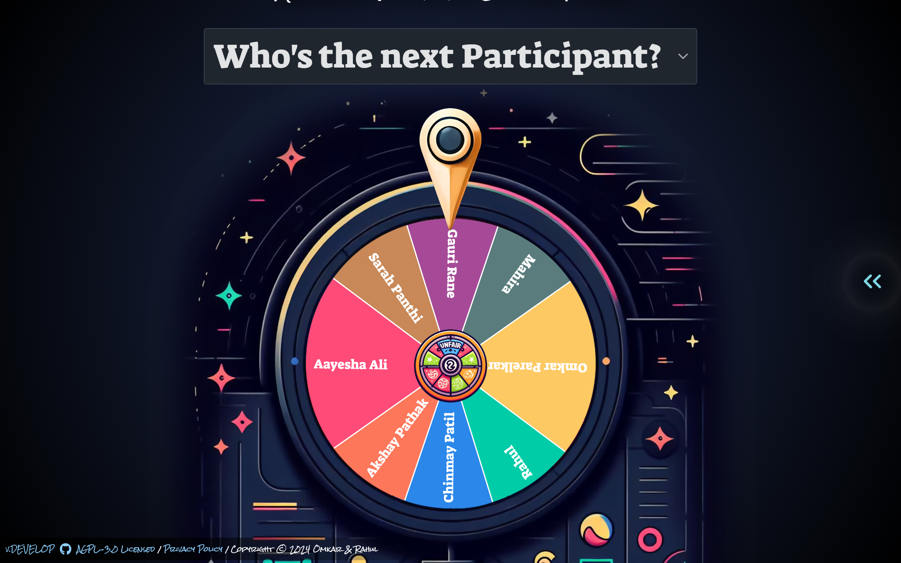
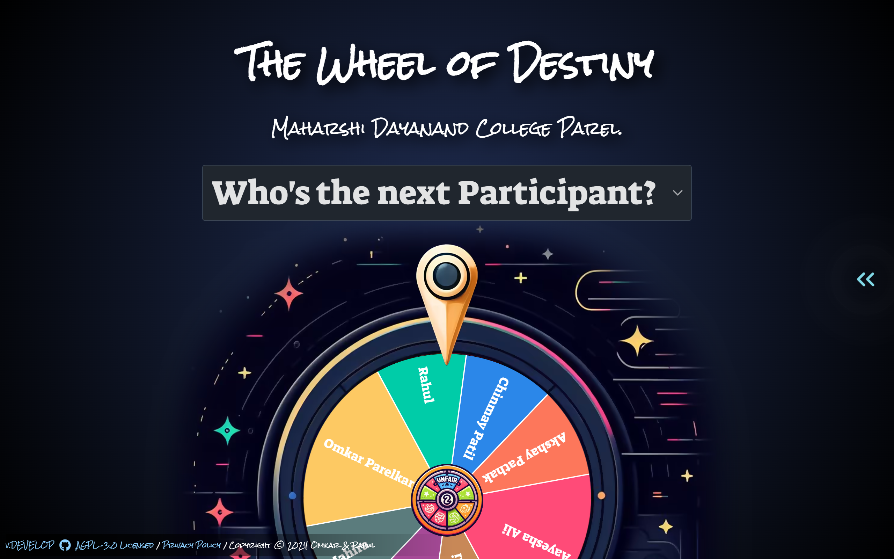

# The Wheel of Destiny

The Wheel of Destiny is an engaging and fun application designed for the orientation of "MD College". It allows users to edit the names of FY students and spin a virtual wheel to determine their fate in various fun activities.

## Features

 - Editable Names: Easily edit and customize the names of FY students to fit the event.
- Interactive Wheel: Spin the wheel to randomly select students for various activities.
- User-Friendly Interface: Simple and intuitive design for ease of use
## Limitations

- No Sound Effects: The current version does not include sound effects.
- No OBS Mode Support: OBS mode is not supported in this version.

  

## Contributions

Contributions are welcome! If you have suggestions for improvements or new features, please feel free to submit a pull request. For major changes, please open an issue first to discuss what you would like to change.
## License

This project is licensed under the MIT License. See the LICENSE file for more details.
## Acknowledgements

- The Wheel of Destiny was inspired by various online spinning wheel games.

- This project is based on an existing open-source project. 
- I have added my own features and modifications to enhance its functionality and usability.
## Contact

- For any questions or feedback, please contact Omkar.
